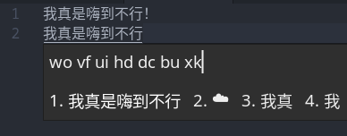
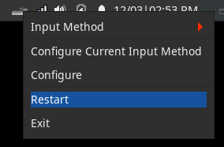

# An Fcitx5 dark theme mimics GNOME Adwaita-dark

## Screenshots

- Input panel:

  

- Menu:

  

## Usage

1. Download the contents of this repo into `~/.local/share/fcitx5/themes/adwaita-dark`, or use `git clone`:

   ```bash
   git clone https://github.com/escape0707/fcitx5-adwaita-dark.git ~/.local/share/fcitx5/themes/adwaita-dark
   ```

2. (Create and) Change `~/.config/fcitx5/conf/classicui.conf` like this:

   ```properties
   # Vertical Candidate List
   Vertical Candidate List=False
   # Use Per Screen DPI
   PerScreenDPI=True
   # Font for Chinese and English, then font size
   Font="Noto Sans CJK SC Regular Noto Sans Regular 12"
   # Theme
   Theme=adwaita-dark
   ```

3. Restart Fcitx5, fine tune if you like, and enjoy.

Issues and PRs are always welcomed.
